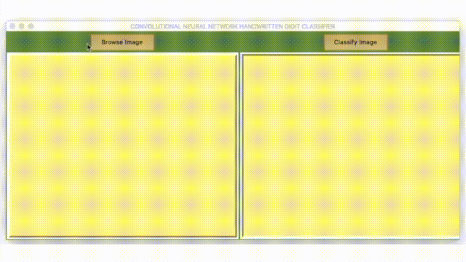

### Handwritten digit recognition application using Convolutional Neural Network

Additional Infos:

    1. Under the hood handwritting recognization happens with Convolutional Neural Network with 
       ADAM Optimizer.
    2. This software uses MNIST Handwritten Digit database for training CNN
    3. Uses PyTkinter for User Interface
    4. Neural Network is implemented using PyTorch

